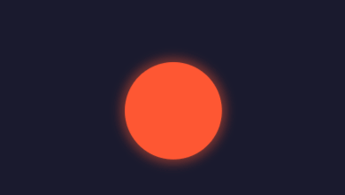

# 📌 Desafio 30 Dias de CSS - Dia 5

## 🎯 Efeito Pulsar

Criando um efeito de pulsação animado utilizando **HTML e CSS**, simulando uma expansão e contração suave.

## 🎨 Tecnologias Utilizadas

- **HTML5**
- **CSS3** (Animações e Transições)

🚀 **Participe do desafio e aprimore suas habilidades em CSS!**

