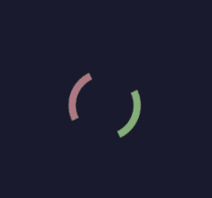
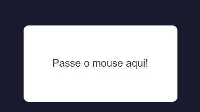
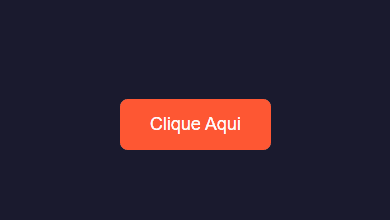
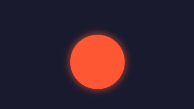
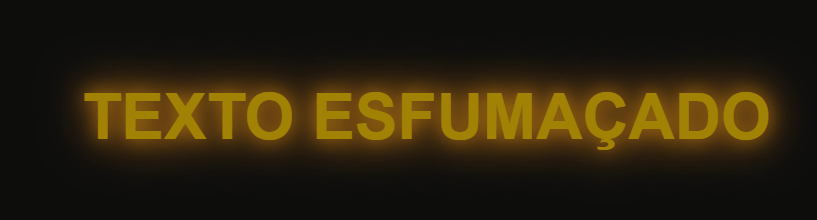

# 🎨 **Desafio 30 Dias de CSS3 - Bora Codar Todo Dia! 🚀**

👩‍🏫 **Professora:** Jenifer
 📚 **Turma:** 70755 - HTML E CSS
 🏫 **Escola:** Coderhouse

------

## 🎯 **Objetivo**

Olá, **Turma 70755!** 🎉

Sejam bem-vindos ao **Desafio 30 Dias de CSS3**, um desafio empolgante para quem quer se tornar um verdadeiro mestre do CSS! 💪🎨

Durante **30 dias seguidos**, vocês vão construir **mini projetos diários** usando **HTML5 + CSS3**, explorando animações, interações visuais e efeitos incríveis.

Essa é a chance perfeita para sair do básico, praticar CSS na vida real e montar um **portfólio incrível**! 🌍🚀

------

## 📌 **Regras do Desafio**

Para tornar esse desafio ainda mais motivador, sigam essas regras simples:

✅ **1. Um projeto por dia!**
 Cada dia trará um novo desafio para testar suas habilidades.

✅ **2. Compartilhe seu progresso!**
 Poste seus projetos no **Discord da turma, GitHub ou redes sociais** (Twitter, LinkedIn, Instagram) usando a hashtag **#30diasCSS** para incentivar outros devs! 💡💙

✅ **3. Conclua o projeto até 23h59!**
 Mesmo que o projeto seja simples, finalize e publique no mesmo dia.

✅ **4. Se divirta e aprenda!**
 Esse desafio é sobre **experimentar, errar, aprender e se tornar melhor!** 🎨✨

------

## 📅 **Calendário de Projetos**

Aqui está a lista de desafios que vocês vão encarar! 🚀

| 🔢 Dia | 📌 Projeto                                         |
| ----- | ------------------------------------------------- |
| 01    |  Ícone de mídia social em camadas |
| 02    |  Loader animado                                |
| 03    |   Mudança de cor de texto quando entra em outra div |
| 04    |  Botão com efeito                                  |
| 05    |  Efeito pulsar                                     |
| 06    |  Efeito Smoke text                                 |
| 07    | Efeito lightning text                             |
| 08    | Preloader Animado                                 |
| 09    | Pêndulo de Newton                                 |
| 10    | Particle Effects                                  |
| 11    | Button Effect Hover and Animation                 |
| 12    | Bouncing Balls                                    |
| 13    | Loading with Effect                               |
| 14    | Pumpkins (Halloween) 🎃                            |
| 15    | Fogos de Artifício 🎇                              |
| 16    | Carrousel 3D 🎠                                    |
| 17    | 30 Dias de CSS 🚀                                  |
| 18    | Loading Animated Light                            |
| 19    | Background Animado 🌈                              |
| 20    | Cube 3D                                           |
| 21    | Dripping Liquid 💧                                 |
| 22    | Buttons Neon Shadow 💡                             |
| 23    | Mouse Move                                        |
| 24    | Efeito Líquido                                    |
| 25    | Coração Pulsar ❤️                                  |
| 26    | Among Us 🛸                                        |
| 27    | Rua Animation 🏙️                                   |
| 28    | Máquina de Escrever ⌨️                             |
| 29    | Relógio ⏰                                         |
| 30    | Cards Finais 🎴                                    |

------

## 🚀 **Como Participar?**

Quer se juntar ao desafio? **Siga esses passos:**

1️⃣ **Crie uma pasta no seu computador ou repositório no GitHub** para armazenar os projetos.

```bash
mkdir 30diasCSS && cd 30diasCSS
```

2️⃣ **Todo dia, crie um novo arquivo HTML e CSS para o desafio do dia!**
 3️⃣ **Compartilhe seu progresso no Discord da turma, GitHub ou redes sociais!**
 4️⃣ **Divirta-se e aprenda com cada desafio!**

------

## 🎖️ **Benefícios de Participar**

- **Prática diária:** Você vai aprender **CSS na prática**, e não apenas na teoria.
- **Portfólio incrível:** No final do desafio, terá **30 projetos para exibir no seu GitHub**!
- **Habilidades avançadas:** Vai dominar **CSS3, animações, flexbox e grid**.
- **Networking:** Compartilhar seu progresso **ajuda a se conectar com outros devs** e aprender mais!

------

## 🤝 **Contribuições**

Se quiser adicionar novos desafios ou melhorias, fique à vontade para abrir um **pull request** ou sugerir ideias!

------

## 🎉 **Gostou da ideia? Então bora codar! 🚀**

Agora é com vocês, **Turma 70755!** **Aceitem o desafio, compartilhem seus projetos e vejam a evolução acontecendo!**

👨‍💻 **Feito com 💙 pela Professora Jenifer para ajudar vocês a crescerem!**

🚀 **#30diasCSS** | **#Turma70755** | **#Coderhouse** | **#AprendaCodando**

